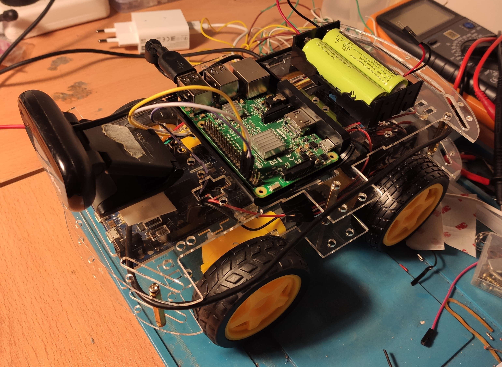

# roverstation

## Overview

ROS control interface to operate Rover. This package is related to:

- [roverbridge](https://github.com/nhorro/roverbridge)
- [rovervision](https://github.com/nhorro/rovervision)

and:

- [rover-firmware](https://github.com/nhorro/rover-firmware)

**Keywords:** rover, ros, raspberrypi, arduino.



### Building from Source

#### Dependencies

- [Robot Operating System (ROS)](http://wiki.ros.org) (middleware for robotics).

#### Building

To build from source, clone the latest version from this repository into your catkin workspace and compile the package using:
```bash
cd catkin_workspace/src
git clone (https://github.com/nhorro/roverstation)
cd ../
rosdep install --from-paths . --ignore-src
catkin_make
```

## Usage

Rover must be executing roverbridge.

```bash
export ROS_IP="RASPBERRY_PI_IP" 
export ROS_MASTER_URI="http://LAPTOP_IP:11311"
roslaunch roverstation panel.launch 
```

## Launch files

* **roverstation.launch:** Launch teleop control and minimal camera view.

## Nodes

### roverteleop

Control vehicle through keyboard.

#### Subscribed Topics

#### Published Topics

* **`/cmd_vel`** ([geometry_msgs/cmd_vel])

	This should be desired Rover linear and angular speeds. However, in the current version as no PID is implemented throttle and angular values are mapped directly to voltage values applied to the motors.
